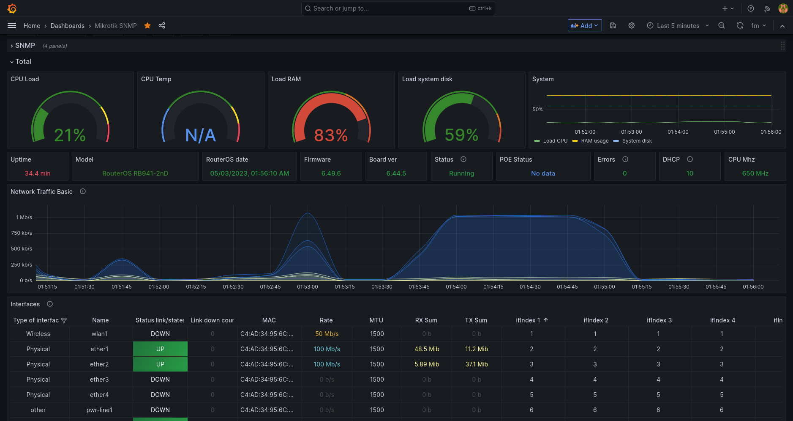
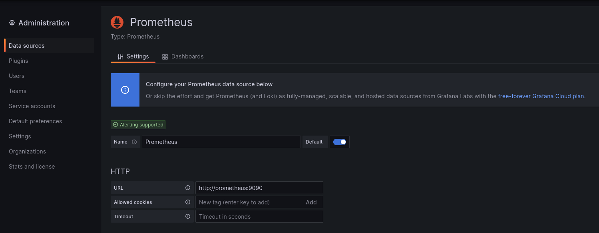

# Monitoring Mikrotik using Grafana

This repo contains a project for monitoring Mikrotik using grafana and snmp exporter running on docker container.

## Dashboard Preview


## How to run
* First step enable `snmp` feature on your mikrotik. Open winbox menu `IP -> SNMP` and check `enable` and save.

* Open `config/prometheus/prometheus.yml` and change **targets** with your mikrotik ip address.
```
  - job_name: "snmp"
    static_configs:
      - targets:
          - 192.168.12.3  # SNMP Device 1
```

* Run docker compose
```
$ docker-compose up -d
[+] Running 3/0
 ⠿ Container prometheus     Running                                        0.0s
 ⠿ Container snmp_exporter  Running                                        0.0s
 ⠿ Container grafana        Running                                        0.0s
```

* Open grafana dashboard on your browser [localhost:3000](localhost:3000).  
For the first time login access using user **admin** password **admin**


* Add **Data Source** and select **Prometheus**. Input colom URL with prometheus ip-address and **save**.


* Back to Home dashboard and import dashboard with **URL** or **Dasboard ID** from this [link](https://grafana.com/grafana/dashboards/10950-mikrotik-exp-router/) and **Load**

Dashboard can be open and displays data from Mikrotik SNMP like this:
